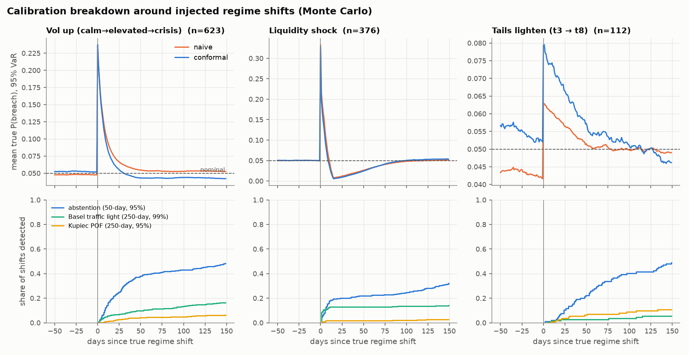
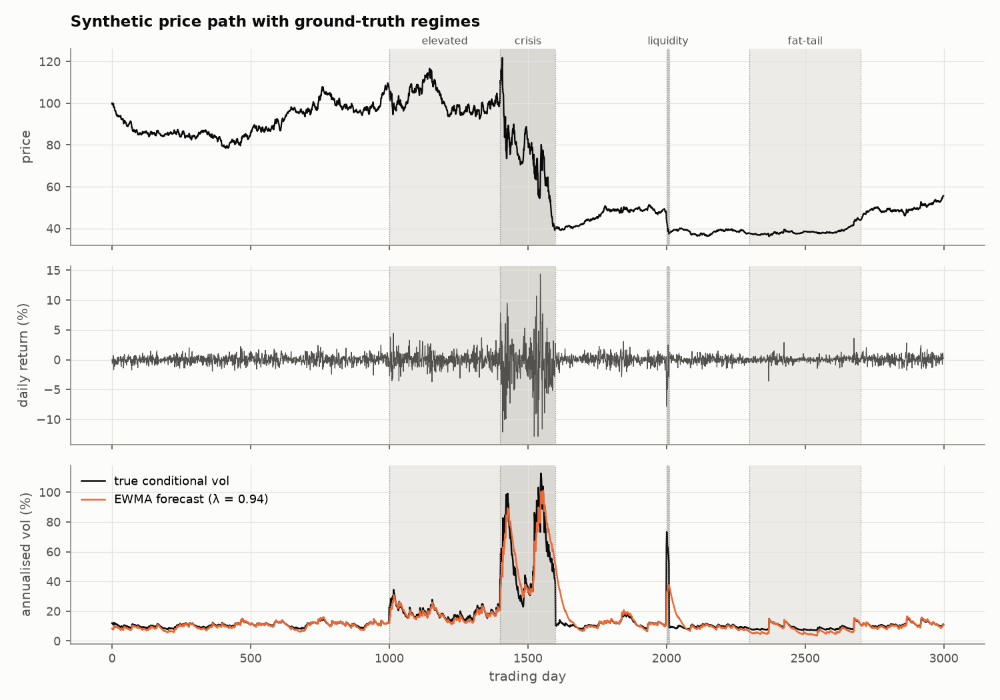
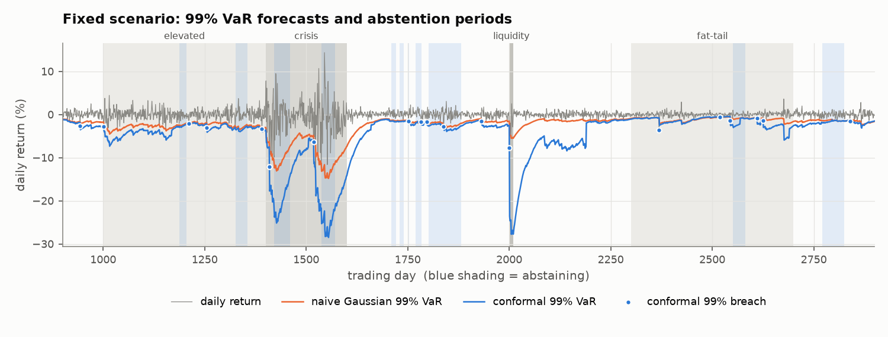

# Regime Risk Engine

> **When does a risk model stop being trustworthy after a regime shift, and can adaptive
> calibration with abstention detect that failure earlier than standard backtesting?**

**Short answer:** the model stops being trustworthy the day the regime shifts, and stays
that way for somewhere between three weeks and several months depending on what changed.
Abstention does catch it much earlier than standard backtesting, but usually not before
the damage is done.

`status: v1 complete`

You can't answer this on real data. You don't know when the regime changed, and you don't
know what the true chance of a big loss was yesterday, so a backtest can only count
breaches after the fact. So I built a synthetic market where I know both: every shift is
labelled, and every day's true breach probability can be computed exactly. Then I can
watch a Value-at-Risk model go wrong day by day and time every alarm against the truth.
It's the same question behind [MedMaps](https://github.com/Ananyasdrafts/medmaps) and
[Vigil](https://github.com/Ananyasdrafts/vigil), when should a model admit it can't be
trusted, asked about market risk this time.

200 simulated markets, 3,000 trading days each, 1,791 regime shifts. Every number is in
[docs/results.json](docs/results.json).

## when does the model stop being trustworthy?

- **immediately.** When volatility jumps, the true chance of breaching the 95% VaR hits
  24% on day one, nearly 5x what it should be.
- **for how long depends on what changed.** After a volatility jump the model fixes
  itself in about 22 days. When the tails get lighter at the same volatility, the
  conformal model is still calibrated on 250 days of the old heavy-tailed losses and is
  *worse* than the naive one (8% vs 6.3% true breach chance) for about 80 days. After a
  single liquidity shock it stays overly cautious for about 200 days, because that one
  loss sits in its calibration window.
- **and a passing backtest won't tell you.** Conformal fixes the overall tail: the
  Gaussian model's 99% VaR gets breached 1.98% of the time and fails Kupiec on 98.5% of
  paths, conformal gets 0.99% and passes on every path. It's still badly wrong for weeks
  after every shift. Averaged over years, those weeks disappear.

## can abstention catch it earlier than backtesting?

- **yes, much earlier.** Of the 324 shifts that did real damage, abstention caught 51%
  within 150 days. The Basel traffic light caught 7.5% and a rolling Kupiec test 1.9%.
  When both fired, abstention was a median 25 days ahead of Basel, and 54 days ahead on
  the tail-lightening case.
- **but usually not before the damage.** After a volatility jump abstention needs about
  23 days to be sure, roughly the time the model takes to fix itself. So it tends to go
  off just as the problem is going away. Sitting out 9% of days barely changed how many
  badly wrong forecasts went out (5.39% to 5.34%).
- **the reason is how little each day tells you.** Abstention, like every backtest,
  counts breaches. That's one bit a day, and at 95% the bit is almost always zero, so any
  alarm built on it needs weeks of evidence.



The top row answers the first question: every shift lined up on the day it happened,
with the true breach probability around it. The bottom row answers the second: how many
shifts each alarm has caught by each day after.

## what I built

- **a synthetic market with labelled regimes.** Returns follow a regime-switching
  GARCH(1,1) with fat-tailed Student-t shocks. Five regimes: calm, elevated, crisis, a
  fat-tail regime with calm-level volatility but much heavier tails, and a short
  liquidity shock that opens with a 6-sigma drop. Every path keeps its true volatility
  and tail shape, so I can compute exactly how likely any VaR number was to be breached.
- **a deliberately boring baseline.** RiskMetrics EWMA volatility with Gaussian VaR and
  Expected Shortfall. The forecaster isn't what's being tested.
- **adaptive conformal VaR and ES** on top of it (ACI, Gibbs and Candès 2021). It
  calibrates the tail from the last 250 standardised losses and nudges its own target
  after every breach or quiet day.
- **an abstention rule.** Hold back the forecast when the last 50 days had implausibly
  many 95% VaR breaches (6 or more when 2.5 are expected, p ≈ 0.04), or when ACI has had
  to drift far from its nominal level.
- **the backtests a bank would actually run**, as the thing to beat: Kupiec
  proportion-of-failures, Christoffersen independence, and the Basel traffic light.



## the numbers

**tail calibration**

| | Gaussian EWMA | + adaptive conformal |
|---|---:|---:|
| 99% VaR breach rate (target 1%) | 1.98% | 0.99% |
| paths where Kupiec rejects the 99% VaR | 98.5% | 0% |
| predicted / true Expected Shortfall at 97.5% (median) | 0.82 | 1.05 |
| days where ES is understated by more than 20% | 44.7% | 17.0% |

ACI pins the long-run breach rate by design, so passing Kupiec is expected here, not
impressive. That's also why a passing backtest says little about whether the model is
right day to day.

**catching harmful shifts** (at least two extra expected 95% VaR breaches)

| alarm | caught within 150 days | median delay |
|---|---:|---:|
| abstention (50-day window) | 51% | 56 days |
| Basel traffic light (250-day window) | 7.5% | 88.5 days |
| Kupiec test (250-day window) | 1.9% | 68 days |

Abstention also goes off on 8.6% of days in settled regimes, against 2.9% for Basel. It
helps most on conformal's own memory problem, where it's a median 54 days ahead of Basel.
The per-shift-type breakdown is in [docs/experiment_results.csv](docs/experiment_results.csv).



A single liquidity shock (day 2000) keeps the conformal 99% VaR inflated for about 200
days, because that one loss stays in the calibration window.

## what I learned

- The right bar for an alarm isn't "faster than Basel", it's "faster than the model fixes
  itself". Beating the backtest was easy. Beating the model's own recovery is the hard,
  useful part, and nothing that counts breaches gets there.
- "Is the model calibrated?" is really two questions: on average, and right now. Most
  backtests only answer the first. Ground truth is what let me separate them.
- Calibration has memory, and memory has a cost. The window that makes conformal robust
  is the same thing that makes it slow to forget an old regime.

## limitations

Everything here is simulated. That's the point, since ground truth is what makes the
measurement possible, but it means the numbers describe this generator, not real
markets. It's one asset with no correlation between assets, and the forecaster is EWMA
only. A GARCH forecaster would heal at a different speed and move the timing results.

## run it

```bash
pip install -e ".[dev]"
python scripts/run_experiment.py     # 200 simulated markets, about 40 seconds
python scripts/make_figures.py       # regenerates docs/images/
```

Tested and runs in CI. Each piece is a small module under `src/regimerisk/`: `generator`
(the synthetic market), `forecast` (EWMA), `conformal` (conformal VaR/ES and abstention),
`backtest` (Kupiec, Christoffersen, Basel) and `evaluate` (true breach probabilities and
the event study). The build log, including the dead ends, is in
[docs/build-notes.md](docs/build-notes.md).

## what's next

- **a monitor that uses every day, not one bit a day.** Watching the whole standardised
  residual (a rolling mean of z², or a check that forecast quantiles are uniform) should
  have far more power than counting breaches. The real question is whether anything can
  fire before the model heals itself.
- **a forecaster that heals at a different speed.** A refit GARCH(1,1) would change the
  window where early detection is even possible.
- **real returns.** No ground truth there, but I can check whether the same lag shows up
  around known stress periods like March 2020.
- **more than one asset.** Correlation regimes, where diversification disappears in a
  crisis, are where portfolio VaR really breaks.
